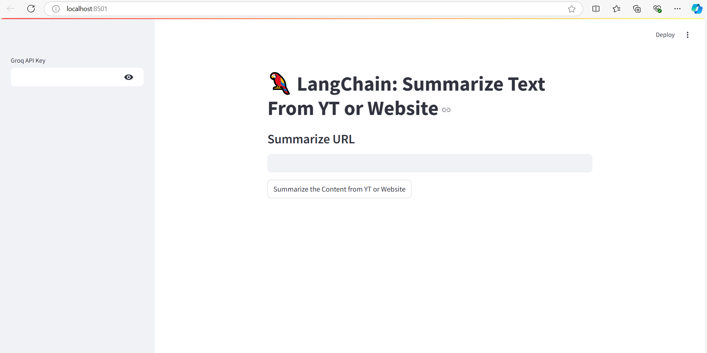
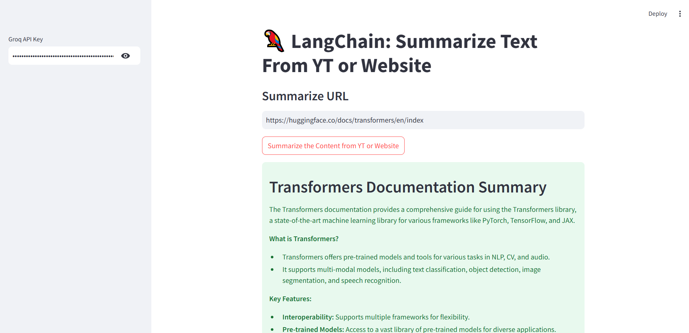

# 🦜 LangChain: Summarize Text From YT or Website
This Streamlit application leverages LangChain and Groq's LLM API to summarize content from YouTube videos or websites. The app allows users to input a YouTube video URL or a generic website URL and get a concise 300-word summary of the content.

## 🛠 Features
+ Summarizes content from YouTube videos or web pages.
+ Uses Groq's Gemma-7b-It language model API for generating summaries.
+ Validates the input URL before processing.
+ Streamlit-based UI for ease of use.

## 🧰 Technologies Used
+ **LangChain**: Framework for building applications with LLMs.
+ **Groq LLM**: Chat-based LLM for generating summaries.
+ **Streamlit**: Web app framework for the user interface.
+ **Python Validators**: For URL validation.
+ **YoutubeLoader & UnstructuredURLLoader**: For loading content from YouTube videos or websites.

## 📑 How It Works
+ The user provides a Groq API key and enters a valid YouTube or website URL.
+ The URL is validated, and the corresponding content is fetched using either YoutubeLoader or UnstructuredURLLoader.
+ The content is then summarized using a pre-defined prompt template via LangChain's summarization chain.
+ The result is displayed in the app.

## 🔧 Setup and Installation
To run this project locally, follow the below steps:
+ **Clone the repository**
Inline `code`

    git clone https://github.com/yourusername/langchain-summary-app.git

    cd langchain-summary-app

+ **Create a virtual environment**
Inline `code`

    conda create -p venv python==3.10 -y 

+ **Install the required dependencies**
Inline `code`

    pip install -r requirements.txt 

+ **Run the app**
Inline `code`

    streamlit run app.py 

## 🚀 Usage
+ Open the app in your browser at http://localhost:XXXX.
+ Enter your Groq API Key in the sidebar.
+ Input a YouTube URL or a website URL to summarize.
+ Click on Summarize the Content to get the summary.

## 📂 File Structure
Inline `code`

    |-- app.py             # The main application code

    |-- requirements.txt   # Required dependencies

    |-- README.md          # Documentation

## User Interface

